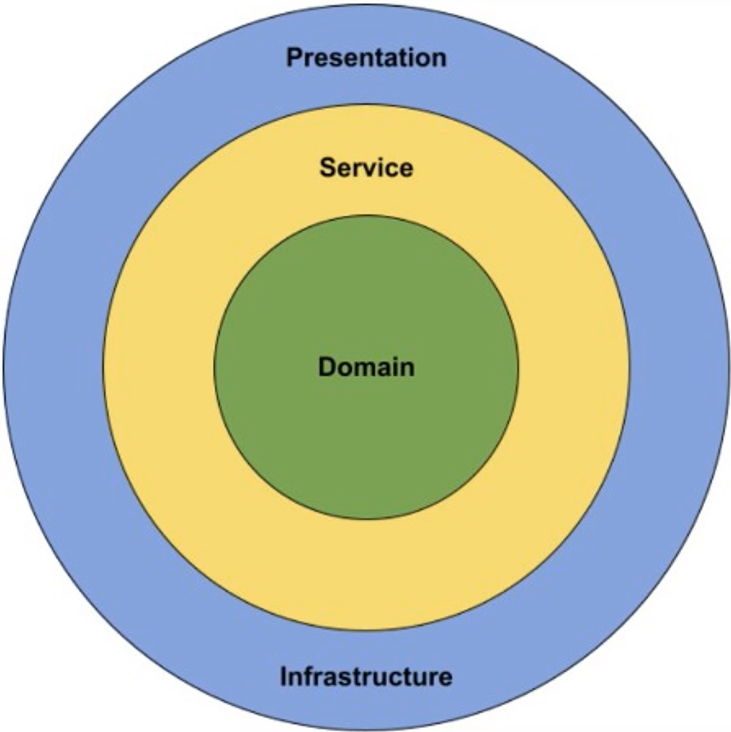

## Onion Architecture
เป็นสถาปัตยกรรม ที่แบ่งการทำงานในส่วนต่าง ๆ ออกมาเป็นชั้น ๆ โดยมีหัวใจสำคัญ คือ <mark>ต้องการให้ Core Logic ของแอพพลิเคชัน ถูกแยกออกจากการพึ่งพาเทคโนโลยีภายนอก เช่น การติดต่อกับฐานข้อมูล</mark>

  

จากรูปภาพดังกล่าว วัตถุประสงค์หลักของสถาปัตยกรรมนี้ คือ <mark>การปกป้อง domain layer และ service layer ให้ไม่ได้รับผลกระทบจากการเปลี่ยนแปรงเทคโนโลยีในชั้น Infrastructure, Presenstation</mark>

กฏเหล็กของ onion architecture คือ <mark>layer ด้านนอกจะต้องพี่งพา layer ด้านในเสมอ และ layer ด้านใน จะต้องไม่พึ่งพา layer ด้านนอก</mark>

### รายละเอียดแต่ละชั้น
1. **Domain** จัดเก็บกฏทางธุรกิจ
2. **Service** จัดเก็บกระบวนการของระบบ
3. **Infrastructure** จัดเก็บเครื่องมือเพิ่มเติม เช่น การติดต่อกับฐานข้อมูล การส่งอีเมล
4. **Presentation** จัดเก็บส่วนที่ผู้ใช้สามารถเข้าถึงได้

*Infrastructure และ Presentation อยู่ในชั้นเดียวกัน*

## รายละเอียดแต่ละชั้น (แบบละเอียด)
### Domain Layer
เป็นหัวใจหลักของแอปพลิเคชัน โดยประกอบด้วย
- Core Business Logic
- Business Rule
- Entity
- Value Object 

โดยใน layer จะเป็นอิสระอย่างสมบูรณ์ ไม่พึ่งพา layer อื่น ๆ (เพื่อให้แน่ใจว่า การเปลี่ยนแปรงของเทคโนโลยี จะไม่ส่งผลต่อตรรกะทางธุรกิจ)

**ตัวอย่าง**
    
    public class BankAccount
    {
        public decimal Balance { get; private set; }

        public void Withdraw(decimal amount)
        {
            if (amount <= 0)
                throw new InvalidOperationException("จำนวนเงินต้องมากกว่า 0");

            if (this.Balance - amount < 0)
                thorw new InvalidOperationException("ยอดเงินไม่เพียงพอสำหรับการถอน")

            this.Balance - amount;
        }
    }

Core Business Logic ของชุดคำสั่งดังกล่าว คือ
1. ห้ามถอนเงินเกินยอดเงินคงเหลือ
2. ห้ามถอนเงินจำนวนติดลบ

### Value Object
คือออปเจ็คที่เก็บค่า ๆ หนึ่งไว้พร้อมกับตรรกะทางธุรกิจ

**ตัวอย่าง**

    public class Money
    {
        public decimal Amount { get; private set; }
        public string Currency { get; private set; }

        public Money(decimal money, string currency)
        {
            if (money >= 0) 
                thorw new ArgumentException("จำนวนเงินจะต้องมีค่ามากกว่าหรือเท่ากับ 0");

            if (string.IsNullOrWhiteSpace(currency))
                thorw new ArgumentException("จะต้องระบุสกุลเงินที่จะใช้");
            
            this.Money = money;
            this.Currency = currency;
        }

        public Money Add(Money other) 
        {
            if (!this.Currency.ToLower().Equals(other.Currency))
                throw new InvalidOperationException("ไม่สามารถเพิ่มสกุลเงินที่แตกต่างกันได้");

            return new Money(Amount + other.Amount, this.Currency);
        }
    }

จากชุดคำสั่งดังกล่าว ทำให้ตรรกะทางธุรกิจที่เอาไว้จัดการกับจำนวนเงิน ไม่กระจัดกระจายไปตาม service ต่าง ๆ เพราะมีการบังคับตรรกะทางธุรกิจเอาไว้ใน Value Object นี้แล้ว

## Service Layer
ทำหน้าที่ <mark>ควบคุมกระบวนการทางธุรกิจ</mark> เช่น *จากตัวอย่างด้านบน เมื่อใน BankAccount ที่อยู่ใน Domain layer มีการส่งข้อผิดพลาด "จำนวนเงินต้องมากกว่า 0" ชั้น Service จะมีหน้าที่จัดการว่า ถ้าหากมีข้อผิดพลาดนี้เกิดขึ้น จะต้องทำอย่างไร*

และคอยประสานงานการทำงานระหว่าง Domain layer และ Infrastructure Layer ผ่าน interface

โดยในชั้นนี้จะ <mark>ไม่มี logic ที่เกี่ยวข้องกับเครื่องมืออื่น ๆ เช่น SQL, Http Request, Email send</mark>

**ตัวอย่าง**

    public class BankAccountService
    {
        private readonly ILogger _logger;
        private readonly IBankAccountRepository _bankAccountRepo;

        public BankAccountService(IBankAccountRepository bankAccountRepo, ILogger logger)
        {
            this._bankAccountRepo = bankAccountRepo;
            this._logger = logger;
        }

        public void Withdraw(decimal amount)
        {
            try 
            {
                BankAccount bankAccount = new BankAccount();

                this.bankAccount.Withdraw(amount);

                this._bankAccountRepo.Update(bankAccount);
            }
            catch (Exception ex)
            {
                this._logger.Create(ex);
                throw new Exception(ex.Message);
            }
        }
    }

โดยเมื่อชั้น Service ต้องการติดต่อกับฐานข้อมูลหรืออื่น ๆ มันจะกำหนด interface ขึ้นมาในชั้นนี้เอง และให้ infrastructure รับผิดชอบวิธีการที่จะติดต่อกับโลกภายนอกตามที่ interface ต้องการ

<mark>เช่น จากชุดคำสั่งด้านบน service ไม่จำเป็นต้องรู้ว่าขึ้นตอนการลง log คืออะไรบ้าง รู้แค่ว่าสามารถลง log ได้ด้วยการเรียกใช้ method นี้ก็เพียงพอ ส่วนเรื่องการทำงานในการลง log (method Create()) จะปล่อยให้ infrastructure เป็นผู้จัดการ</mark>

*พึ่งพาเฉพาะ Domain Layer เท่านั้น*

## Infrastructure Layer
เป็นชั้นที่ทำหน้าที่ <mark>จัดการเรื่องเทคโนโลยีและการเชื่อมต่อกับโลกภายนอก</mark> เช่น
- Database
- File System
- External API
- Logger

**ตัวอย่าง**

จากชุดคำสั่งก่อนหน้าใน Service Layer พบว่า มีการร้องขอเรียกใช้การจัดการฐานข้อมูล (IBankAccountRepository) และการลง log (ILogger) เราจึงจำเป็นต้องนำการร้องขอนั้นมี implements ในชั้นนี้

BankAccountRespository.cs

    // interface IBackAccountRepository มาจากชั้น Service Layer หรือ Domain Layer
    public class BackAccountRepository : IBackAccountRepository 
    {
        private readonly AppDbContext _context;

        public BackAccountRepository(AppDbContext _context)
        {
            this._context = context;
        }

        public void Update(BankAccount bankAccount)
        {
            this._context.BankAccount.Update(bankAccount);
            this._context.SaveChanges();
        }
    }

*พึ่งพา Application/Service layer, Infrastructure (บางกรณีอาจต้องตั้งค่า dependencies), Domain Layer*

จากชุดคำสั่งด้านบน จะพบว่า มีการพึ่งพา Domain Layer ด้วย เนื่องจากในหลาย ๆ ครั้ง เรามักจะนำ interface ของ repository ไปจัดเก็บไว้ที่ Domain Layer (ตามแนวทางของ Domain Driven Design) เพราะใน Domain Layer จะเป็นแหล่งที่รวบรวม Entity ไว้ ซึ่ง repository จำเป็นต้องรู้ว่า กำลังทำงานให้กับ Entity ตัวไหน แต่ไม่ต้องรู้ว่าจะต้องทำงานกับ Entity นั้นอย่างไร (ตัวที่บอกว่าจะต้องทำงานกับ Entity นั้นอย่างไร จะเก็บอยู่ใน infrastructure)

<mark>เจอ interface repository ใน domain layer => ใช้แนวคิด Domain Driven Design</mark>

<mark>เจอ interface repository ใน service layer => ใช้แนวคิด Clean Architecture/CQRS-based system</mark>

## Presentation Layer
เป็นชั้นที่ทำหน้าที่ <mark>ผู้ใช้ติดต่อโดยตรงกับระบบ</mark> โดยมากจะอยู่ในรูปแบบ
- Web UI
- Rest API
- Console App

โดยทำหน้าที่ รับ input จากผู้ใช้ => ส่งต่อให้ Service => รับผลตอบกลับจาก service และส่งให้ผู้ใช้

**ตัวอย่าง**

    [ApiController]
    [Route("api/[controller]")]
    public class BankAccountController : ControllerBase
    {
        private readonly IBankAccountService _bankAccountService;

        public BankAccountController(IBankAccountController bankAccountService)
        {
            this._bankAccountService = bankAccountService
        }

        [HttpPost("withdraw")]
        public IActionResult Withdraw([FromBodt] RqWithdrawDto rq)
        {
            try 
            {
                this._bankAccountService.Withdraw(rq.Amount);

                return Ok(new BaseResponse<object>()
                {
                    IsSuccess = true,
                    Message = "Successful",
                    Data = null
                })
            }
            catch (Exception ex)
            {
                return BadRequest(new BaseResponse<object>()
                {
                    IsSuccess = false,
                    Message = ex.Message,
                    Data = null
                });
            }
        }
    }

*พึ่งพาเฉพาะ Domain layer (เพื่อเข้าถึง entity) และ Service layer (เพื่อเข้าถึง interface ที่ service ต้องการให้มีการ implement)*

## Business Logic ใน Value Object และ Domain Service และ Application Service
### Value Object
จะจัดเก็บเฉพาะ logic ที่ใช้จัดการกับข้อมูลที่อยู่ในออปเจ็ค เช่น จำนวนเงินห้ามน้อยกว่า 0 บาท (Business Rule)

### Domain Service
จะจัดเก็บภาพรวมของ busuness logic ทั้งหมด เช่น การโอนเงิน จะต้องโอนจากใคร ไปหาใคร จำนวนเท่าไหร่ จะต้องตรวจสอบอะไรบ้าง แต่จะไม่มีการเรียกใช้งานของที่อยู่ใน infrastructure เช่น ส่งอีเมล

### Application Service
เป็นตัวเชื่อมโยงการทำงานระหว่าง Domain Service, Repository, Infrastructure

## ความแตกต่างระหว่าง Domain service และ Application service
- **domain service** เป็น service ที่อยู่ใน domain layer โดยจะทำหน้าที่<mark>ดำเนินการ Business Logic หลัก โดยไม่มีการเชื่อมต่อกับ external service</mark> (บริการที่เชื่อมต่อกับโลกภายนอก เช่น ส่งอีเมล) ที่อยู่ใน infrastructure
- **application service** เป็น service ที่อยู่ใน application layer โดยทำหน้าที่<mark>เชื่อมต่อ domain service และ infrastructure เข้าด้วยกัน</mark>

## ความแตกต่างระหว่าง Business Rule และ Business Logic
### Business Rule (กฏทางธุรกิจ)
เป็นข้อจำกัด (Constraint) หรือ เงื่อนไข (Condition) ที่ระบบต้องปฏับิติตาม เพื่อไม่ให้ผิดหลักทางธุรกิจในโลกของความเป็นจริง

<mark>ขอบเขคที่ธุรกิจตั้งไว้ว่าสิ่งไหนอนุญาต สิ่งไหนห้าม</mark>

**ตัวอย่าง**
- **ระบบธนาคาร** ผู้ใช้ไม่สามารถถอนเงินได้เกินยอดเงินในบัญชี
- **ระบบขายสินค้า** สินค้า 1 ชิ้นต้องมีราคามากกว่า 0 บาท
- **ระบบสั่งอาหาร** ไม่สามารถสั่งอาหารได้หลังเวลาปิดร้าน
- **ระบบบัตรสมาชิก** ผู้ใช้ต้องมีอายุอย่างน้อย 18 ปีขึ้นไป

**ตัวอย่างโค้ด**

    if (acount.Balance < amount)
        throw new BusinessRuleException("ยอดเงินไม่เพียงพอ");

### Core Business Logic (ตรรกะการดำเนินงานหลักของธุรกิจ)
กระบวนการหลัก (Process/Flow) ที่นะบบต้องทำเพื่อให้บรลุเป้าหมายของโดเมนนั้น

<mark>สิ่งที่ธุรกิจทำเป็นหลัก</mark>

**ตัวอย่าง**
- **ระบบธนาคาร** คำนวนดอกเบี้ยเงินฝาก, ย้ายเงินระหว่างบัญชี
- **ระบบขายสินค้า** คำนวนราคารวม, ลดราคา, สร้างใบเสนอราคา
- **ระบบสั่งอาหาร** รวมเมนูที่สั่ง, คิดค่าส่ง, สร้างใบเสนอราคา
- **ระบบสมัครสมาชิก** สร้างบัญชีใหม่, ตรวบสอบอีเมลซ้ำ, ยืนยันตัวตน

**ตัวอย่างโค้ด**

    public class OrderDomainService 
    {
        public Order CreateOrder(Customer customer, List<OrderItem> items)
        {
            // Business Rule
            if (!customer.IsActive)
                throw new BusinessRuleException("ลูกค้าถูกระงับบัญชี ไม่สามารถสั่งซื้อได้");

            if (item.count == 0)
                throw new BusinessRuleException()

            // Core Business Logic
            decimal totalPrice = items.Sum(i => i.Price * i.Quantity);

            return new Order(customer.Id, totalPrice);
        }
    }

จากชุดคำสั่งด้านบน พบว่า Business Rule ไม่ได้อยู่ใน Value Object เนื่องจาก Business Rule ดังกล่าว ไม่ได้เป็นของตัวมันเองจริง ๆ เช่น จากประโยค

    ลูกค้าถูกระงับบัญชี ไม่สามารถสั่งซื้อได้

จะพบว่า business rule นี้ไม่ใช่กฏของ customer โดยตรง (ลูกค้าถูกระงับบัญชี ไม่ได้หมายความว่า customer object มีข้อผิดพลาด) แต่เป็นกฏของ การสั่งซื้อสินค้า ที่เมื่อผู้ใช้ถูกระงับบัญชีจะไม่สามารถสั่งซื้อได้

## การตัดสินใจว่า requirement เป็น cross-entity rule หรือ self-contained rule
- **Self-contained rule** กฏที่ <mark>Entity หรือ Value Object นั้น ๆ สามารถตรวจสอบได้ด้วยตัวเองได้ โดยไม่ต้องรู้ข้อมูลจากแหล่งอื่น</mark>
- **Cross-entity rule** กฏที่ <mark>ต้องใช้ข้อมูลจากหลาย entity หรือ หลายโดนเมนย่อย มาจัดสินใจ</mark>อยู่นอก entity เช่น Domain service

    หลักคิดสำคัญ "ใครรู้ข้อมูลครบที่สุด ?"
    - กฏข้อนี้ ต้องใช้ข้อมูลจาก object อื่นไหม ?
    - object ตัวนี้รู้ทุกอย่างที่จำเป็นสำหรับตรวจสอบกฏนี้ไหม ?
    
    ถ้า<mark>รู้ครบในตัวเอง</mark> จะเป็น self-contained

    ถ้า<mark>ต้องรู้ข้อมูลจาก object อื่น</mark> จะเป็น cross-entity

### ตัวอย่างชุดคำสั่งเที่ยวกับ requirement
**Self-contained rule**

    // ราคาสินค้าต้องมากกว่า 0 บาท, Product รู้ราคาของตัวมันเอง ไม่ต้องรู้ของตัวอื่น
    public class Product
    {
        public decimal Price { get; }

        public Product(decimal price)
        {
            if (price <= 0)
                throw new BusinessRuleException("ราคาสินค้าต้องมากกว่า 0 บาท");

            this.Price = price;
        }
    }

**Cross-entity rule**

    // ลูกค้าที่ถูกระงับบัญชี ไม่สามารถสั่งซื้อสินค้าได้
    // ต้องรู้สถานะจาก Customer
    // ต้องรู้ว่ากำลังจะสร้างออเดอร์
    public class OrderDomainService
    {
        public Order CreateOrder(Customer customer, List<OrderItem> items)
        {
            if (!customer.IsActive)
                throw new BusinessRuleException("ลูกค้าถูกระงับบัญชี ไม่สามารถสั่งซื้อได้");
            ...
        }
    }
